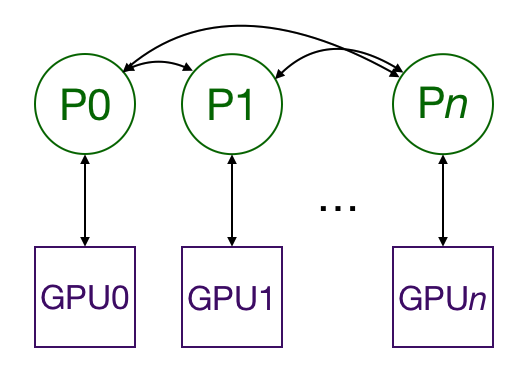

# Distributed data parallel training in Pytorch

## Motivation

The easiest way to speed up neural network training is to use a GPU, which provides large speedups over CPUs on the types of calculations (matrix multiplies and additions) that are common in neural networks. As the model or dataset gets bigger, one GPU quickly becomes insufficient. For example, big language models such as [BERT](https://arxiv.org/abs/1810.04805) and [GPT-2](https://d4mucfpksywv.cloudfront.net/better-language-models/language_models_are_unsupervised_multitask_learners.pdf) are trained on hundreds of GPUs. To multi-GPU training, we must have a way to split the model and data between different GPUs and to coordinate the training. 


### Why distributed data parallel?

I like to implement my models in Pytorch because I find it has the best balance between control and ease of use of the major neural-net frameworks. Pytorch has two ways to split models and data across multiple GPUs: [`nn.DataParallel`](https://pytorch.org/docs/stable/nn.html#dataparallel) and [`nn.DistributedDataParallel`](https://pytorch.org/docs/stable/nn.html#distributeddataparallel). `nn.DataParallel` is easier to use (just wrap the model and run your training script). However, because it uses one process to compute the model weights and then distribute them to each GPU during each batch, networking quickly becomes a bottle-neck and GPU utilization is often very low. Furthermore, `nn.DataParallel` requires that all the GPUs be on the same node and doesn't work with [Apex](https://nvidia.github.io/apex/amp.html) for [mixed-precision](https://devblogs.nvidia.com/mixed-precision-training-deep-neural-networks/) training. 

### The existing documentation is insufficient

In general, the Pytorch documentation is thorough and clear, especially in version 1.0.x. I taught myself Pytorch almost entirely from the documentation and tutorials: this is definitely much more a reflection on Pytorch's ease of use and excellent documentation than it is any special ability on my part. So I was very surprised when I spent some time trying to figure out how to use `DistributedDataParallel` and found all of the examples and tutorials to be some combination of inaccessible, incomplete, or overloaded with irrelevant features. 

Pytorch provides a [tutorial](https://pytorch.org/tutorials/beginner/aws_distributed_training_tutorial.html) on distributed training using AWS, which does a pretty good job of showing you how to set things up on the AWS side. However, the rest of it is a bit messy, as it spends a lot of time showing how to calculate metrics for some reason before going back to showing how to wrap your model and launch the processes. It also doesn't describe what `nn.DistributedDataParallel` does, which makes the relevant code blocks difficult to follow. 

The [tutorial](https://pytorch.org/tutorials/intermediate/dist_tuto.html) on writing distributed applications in Pytorch has much more detail than necessary for a first pass and is not accessible to somebody without a strong background on multiprocessing in Python. It spends a lot of time replicating the functionality in `nn.DistributedDataParallel`. However, it doesn't give a high-level overview of what it does and provides no insight on how to *use* it. 
(https://pytorch.org/tutorials/intermediate/ddp_tutorial.html)

There's also a Pytorch [tutorial](https://pytorch.org/tutorials/intermediate/ddp_tutorial.html) on getting started with distributed data parallel. This one shows how to do some setup, but doesn't explain what the setup is for, and then shows some code to split a model across GPUs and do one optimization step. Unfortunately, I'm pretty sure the code as written won't run (the function names don't match up) and furthermore it doesn't tell you *how* to run the code. Like the previous tutorial, it also doesn't give a high-level overview of how distributed training works. 

The closest to a MWE example Pytorch provides is the [Imagenet](https://github.com/pytorch/examples/tree/master/imagenet) training example. Unfortunately, that example also demonstrates pretty much every other feature Pytorch has, so it's difficult to pick out what pertains to distributed, multi-GPU training. 

Apex provides their own [version](https://github.com/NVIDIA/apex/tree/master/examples/imagenet) of the Pytorch Imagenet example. The documentation there tells you that their version of `nn.DistributedDataParallel` is a drop-in replacement for Pytorch's, which is only helpful after learning how to use Pytorch's. 

This [tutorial](http://www.telesens.co/2019/04/04/distributed-data-parallel-training-using-pytorch-on-aws/) has a good description of what's going on under the hood and how it's different from `nn.DataParallel`. However, it doesn't have code examples of how to use `nn.DataParallel`.

## Outline

This tutorial is really directed at people who are already familiar with training neural network models in Pytorch, and I won't go over any of those parts of the code. I'll begin by summarizing the big picture. I then show a minimum working example of training on MNIST using on GPU. I modify this example to train on multiple GPUs, possibly across multiple nodes, and explain the changes line by line. Importantly, I also explain how to run the code. As a bonus, I also demonstrate how to use Apex to do easy mixed-precision distribued training. 

## The big picture

Multiprocessing with `DistributedDataParallel` duplicates the model across multiple GPUs, each of which is controlled by one process. (If you want, you can have each process control multiple GPUs, but that should be obviously slower than having one GPU per process. It's also possible to have multiple worker processes that fetch data for each GPU, but I'm going to leave that out for the sake of simplicity.) The GPUs can all be on the same node or spread across multiple nodes. Every process does identical tasks, and each process communicates with all the others. Only gradients are passed between the processes/GPUs so that network communication is less of a bottleneck. 



During training, each process loads its own minibatches from disk and passes them to its GPU. Each GPU does its own forward pass, and then the gradients are all-reduced across the GPUs. Gradients for each layer do not depend on previous layers, so the gradient all-reduce is calculated concurrently with the backwards pass to futher alleviate the networking bottleneck. At the end of the backwards pass, every node has the averaged gradients, ensuring that the model weights stay synchronized. 

All this requires that the multiple processes, possibly on multiple nodes, are synchronized and communicate. Pytorch does this through its [`distributed.init_process_group`](https://pytorch.org/docs/stable/distributed.html#initialization) function. This function needs to know where to find process 0 so that all the processes can sync up and the total number of processes to expect. Each individual process also needs to know the total number of processes as well as its rank within the processes and which GPU to use. It's common to call the total number of processes the *world size*. Finally, each process needs to know which slice of the data to work on so that the batches are non-overlapping. Pytorch provides [`nn.utils.data.DistributedSampler`](https://pytorch.org/docs/stable/_modules/torch/utils/data/distributed.html) to accomplish this. 

## Minimum working examples with explanations

To demonstrate how to do this, I'll create an example that [trains on MNIST](https://github.com/yangkky/distributed_tutorial/blob/master/src/mnist.py), and then modify it to run on [multiple GPUs across multiple nodes](https://github.com/yangkky/distributed_tutorial/blob/master/src/mnist-distributed.py), and finally to also allow [mixed-precision training](https://github.com/yangkky/distributed_tutorial/blob/master/src/mnist-mixed.py). 

### Without multiprocessing

First, we import everything we need. 

```python {.line-numbers}
import os
from datetime import datetime
import argparse
import torch.multiprocessing as mp
import torchvision
import torchvision.transforms as transforms
import torch
import torch.nn as nn
import torch.distributed as dist
from apex.parallel import DistributedDataParallel as DDP
from apex import amp
```

We define a very simple convolutional model for predicting MNIST. 

```python
class ConvNet(nn.Module):
    def __init__(self, num_classes=10):
        super(ConvNet, self).__init__()
        self.layer1 = nn.Sequential(
            nn.Conv2d(1, 16, kernel_size=5, stride=1, padding=2),
            nn.BatchNorm2d(16),
            nn.ReLU(),
            nn.MaxPool2d(kernel_size=2, stride=2))
        self.layer2 = nn.Sequential(
            nn.Conv2d(16, 32, kernel_size=5, stride=1, padding=2),
            nn.BatchNorm2d(32),
            nn.ReLU(),
            nn.MaxPool2d(kernel_size=2, stride=2))
        self.fc = nn.Linear(7*7*32, num_classes)

    def forward(self, x):
        out = self.layer1(x)
        out = self.layer2(out)
        out = out.reshape(out.size(0), -1)
        out = self.fc(out)
        return out
```

The `main()` function will take in some arguments and run the training function. 

```python
def main():
    parser = argparse.ArgumentParser()
    parser.add_argument('-n', '--nodes', default=1, type=int, metavar='N')
    parser.add_argument('-g', '--gpus', default=1, type=int,
                        help='number of gpus per node')
    parser.add_argument('-nr', '--nr', default=0, type=int,
                        help='ranking within the nodes')
    parser.add_argument('--epochs', default=2, type=int, metavar='N',
                        help='number of total epochs to run')
    args = parser.parse_args()
    train(0, args)
```

And here's the train function. 

```python
def train(gpu, args):
    model = ConvNet()
    torch.cuda.set_device(gpu)
    model.cuda(gpu)
    batch_size = 100
    # define loss function (criterion) and optimizer
    criterion = nn.CrossEntropyLoss().cuda(gpu)
    optimizer = torch.optim.SGD(model.parameters(), 1e-4)
    # Data loading code
    train_dataset = torchvision.datasets.MNIST(root='./data',
                                               train=True,
                                               transform=transforms.ToTensor(),
                                               download=True)
    train_loader = torch.utils.data.DataLoader(dataset=train_dataset,
                                               batch_size=batch_size,
                                               shuffle=True,
                                               num_workers=0,
                                               pin_memory=True)

    start = datetime.now()
    total_step = len(train_loader)
    for epoch in range(args.epochs):
        for i, (images, labels) in enumerate(train_loader):
            images = images.cuda(non_blocking=True)
            labels = labels.cuda(non_blocking=True)
            # Forward pass
            outputs = model(images)
            loss = criterion(outputs, labels)

            # Backward and optimize
            optimizer.zero_grad()
            loss.backward()
            optimizer.step()
            if (i + 1) % 100 == 0 and gpu == 0:
                print('Epoch [{}/{}], Step [{}/{}], Loss: {:.4f}'.format(epoch + 1, args.epochs, i + 1, total_step,
                                                                         loss.item()))
    if gpu == 0:
        print("Training complete in: " + str(datetime.now() - start))
```

Finally, we want to make sure the `main()` function gets called. 

```python
if __name__ == '__main__':
    main()
```

There's definitely some extra stuff in here (the number of gpus and nodes, for example) that we don't need yet, but it's helpful to put the whole skeleton in place. 

We can run this code by opening a terminal and typing `python src/mnist.py -n 1 -g 1 -nr 0`, which will train on a single gpu on a single node. 

### With multiprocessing

To do this with multiprocessing, we need a script that will launch a process for every GPU. Each process needs to know which GPU to use, and where it ranks amongst all the processes that are running. We'll need to run the script on each node. 

Let's take a look at the changes to each function. I've fenced off the new code to make it easy to find. 

```python
def main():
    parser = argparse.ArgumentParser()
    parser.add_argument('-n', '--nodes', default=1, type=int, metavar='N')
    parser.add_argument('-g', '--gpus', default=1, type=int,
                        help='number of gpus per node')
    parser.add_argument('-nr', '--nr', default=0, type=int,
                        help='ranking within the nodes')
    parser.add_argument('--epochs', default=2, type=int, metavar='N',
                        help='number of total epochs to run')
    args = parser.parse_args()
    #########################################################
    args.world_size = args.gpus * args.nodes                #
    os.environ['MASTER_ADDR'] = '10.57.23.164'              #
    os.environ['MASTER_PORT'] = '8888'                      #
    mp.spawn(train, nprocs=args.gpus, args=(args,))         #
    #########################################################
```

I hand-waved over the arguments in the last section, but now we actually need them. 

- `args.nodes` is the total number of nodes we're going to use. 
- `args.gpus` is the number of gpus on each node. 
- `args.nr` is the rank of the current node within all the nodes, and goes from 0 to `args.nodes` - 1. 

Now, let's go through the new changes line by line: 

Line 12: Based on the number of nodes and gpus per node, we can calculate the `world_size`, or the total number of processes to run, which is equal to the total number of gpus because we're assigning one gpu to every process. 

Line 13: This tells the multiprocessing module what IP address to look at for process 0. It needs this so that all the processes can sync up initially. 

Line 14: Likewise, this is the port to use when looking for process 0. 

Line 15: Now, instead of running the train function once, we will spawn `args.gpus` processes, each of which runs `train(i, args)`, where `i` goes from 0 to `args.gpus` - 1. Remember, we run the `main()` function on each node, so that in total there will be `args.nodes` * `args.gpus` = `args.world_size` processes. 

Instead of lines 13 and 14, I could have run `export MASTER_ADDR=10.57.23.164` and `export MASTER_PORT=8888` in the terminal. 

Next, let's look at the modifications to `train`. I'll fence the new lines again. 

```python
def train(gpu, args):
    ######################################################################
    rank = args.nr * args.gpus + gpu	                          
    dist.init_process_group(                                   
    	backend='nccl',                                         
   		init_method='env://',                                   
    	world_size=args.world_size,                              
    	rank=rank                                               
    )                                                          
    ######################################################################
    
    model = ConvNet()
    torch.cuda.set_device(gpu)
    model.cuda(gpu)
    batch_size = 100
    # define loss function (criterion) and optimizer
    criterion = nn.CrossEntropyLoss().cuda(gpu)
    optimizer = torch.optim.SGD(model.parameters(), 1e-4)
    
    ######################################################################
    # Wrap the model
    model = nn.parallel.DistributedDataParallel(model, device_ids=[gpu])
    ######################################################################

    # Data loading code
    train_dataset = torchvision.datasets.MNIST(root='./data',
                                               train=True,
                                               transform=transforms.ToTensor(),
                                               download=True)
                                               
    ######################################################################
    train_sampler = torch.utils.data.distributed.DistributedSampler(
    	train_dataset,
    	num_replicas=args.world_size,
    	rank=rank
    )
    ######################################################################

    train_loader = torch.utils.data.DataLoader(dataset=train_dataset,
                                               batch_size=batch_size,
    ######################################################################
                                               shuffle=False,            #
    ######################################################################
                                               num_workers=0,
                                               pin_memory=True,
    ######################################################################
                                               sampler=train_sampler)    # 
    ######################################################################

    start = datetime.now()
    total_step = len(train_loader)
    for epoch in range(args.epochs):
        for i, (images, labels) in enumerate(train_loader):
            images = images.cuda(non_blocking=True)
            labels = labels.cuda(non_blocking=True)
            # Forward pass
            outputs = model(images)
            loss = criterion(outputs, labels)

            # Backward and optimize
            optimizer.zero_grad()
            loss.backward()
            optimizer.step()
            if (i + 1) % 100 == 0 and gpu == 0:
                print('Epoch [{}/{}], Step [{}/{}], Loss: {:.4f}'.format(epoch + 1, args.epochs, i + 1, total_step,
                                                                         loss.item()))
    if gpu == 0:
        print("Training complete in: " + str(datetime.now() - start))
```

Line 3: This is the global rank of the process within all of the processes (one process per GPU). We'll use this for line 6. 

Lines 4 - 6: Initialize the process and join up with the other processes. This is "blocking," meaning that no process will continue until all processes have joined. I'm using the `nccl` backend here because the [pytorch docs](https://pytorch.org/docs/stable/distributed.html) say it's the fastest of the available ones. The `init_method` tells the process group where to look for some settings. In this case, it's looking at environment variables for the `MASTER_ADDR` and `MASTER_PORT`, which we set within `main`. I could have set the `world_size` there as well as `WORLD_SIZE`, but I'm choosing to set it here as a keyword argument, along with the global rank of the current process. 

Line 23: Wrap the model as a [`DistributedDataParallel`](https://pytorch.org/docs/stable/nn.html#distributeddataparallel) model. This reproduces the model onto the GPU for the process. 

Lines 32-36: The [`nn.utils.data.DistributedSampler`](https://pytorch.org/docs/stable/_modules/torch/utils/data/distributed.html) makes sure that each process gets a different slice of the training data. 

Lines 42 and 47: Use the `nn.utils.data.DistributedSampler` instead of shuffling the usual way. 

To run this on, say, 4 nodes with 8 GPUs each, we need 4 terminals (one on each node). On node 0 (as set by line 13 in `main`): 

```python src/mnist-distributed.py -n 4 -g 8 -nr 0```

Then, on the other nodes: 

```python src/mnist-distributed.py -n 4 -g 8 -nr i```

for $i \in \{1, 2, 3\}$. In other words, we run this script on each node, telling it to launch `args.gpus` processes that sync with each other before training begins. 

Note that the effective batchsize is now the per/GPU batchsize (the value in the script) * the total number of GPUs (the worldsize). 


### With Apex for mixed precision

Mixed precision training (training in a combination of float (FP32) and half (FP16) precision) allows us to use larger batch sizes and take advantage of NVIDIA [Tensor Cores](https://www.nvidia.com/en-us/data-center/tensorcore/) for faster computation. AWS [p3](https://aws.amazon.com/ec2/instance-types/p3/) instances use NVIDIA Tesla V100 GPUs with Tensor Cores. We only need to change the `train` function. For the sake of concision, I've taken out the data loading code and the code after the backwards pass from the example here, replacing them with `...`, but they are still in the [full script](https://github.com/yangkky/distributed_tutorial/blob/master/src/mnist-mixed.py). 

```python
def train(gpu, args):
    rank = args.nr * args.gpus + gpu
    dist.init_process_group(
        backend='nccl',
        init_method='env://',
        world_size=args.world_size,
        rank=rank)

    model = ConvNet()
    torch.cuda.set_device(gpu)
    model.cuda(gpu)
    batch_size = 100
    # define loss function (criterion) and optimizer
    criterion = nn.CrossEntropyLoss().cuda(gpu)
    optimizer = torch.optim.SGD(model.parameters(), 1e-4)
    # Wrap the model
    ######################################################################
    model, optimizer = amp.initialize(model, optimizer, opt_level='O2')
    model = DDP(model)
    ######################################################################
    # Data loading code
	...
    start = datetime.now()
    total_step = len(train_loader)
    for epoch in range(args.epochs):
        for i, (images, labels) in enumerate(train_loader):
            images = images.cuda(non_blocking=True)
            labels = labels.cuda(non_blocking=True)
            # Forward pass
            outputs = model(images)
            loss = criterion(outputs, labels)

            # Backward and optimize
            optimizer.zero_grad()
    ######################################################################
            with amp.scale_loss(loss, optimizer) as scaled_loss:
                scaled_loss.backward()
    ######################################################################
            optimizer.step()
     ...
```

Line 17: [`amp.initialize`](https://nvidia.github.io/apex/amp.html#unified-api) wraps the model and optimizer for mixed precision training. Note that that the model must already be on the correct GPU before calling `amp.initialize`. The `opt_level` goes from `O0`, which uses all floats, through `O3`, which uses half-precision throughout. `O1` and `O2` are different degrees of mixed-precision, the details of which can be found in the Apex [documentation](https://nvidia.github.io/apex/amp.html#opt-levels-and-properties). Yes, the first character in all those codes is a capital letter 'O', while the second character is a number. Yes, if you use a zero instead, you will get a baffling error message. 

Line 18: [`apex.parallel.DistributedDataParallel`](https://nvidia.github.io/apex/parallel.html) is a drop-in replacement for `nn.DistributedDataParallel`. We no longer have to specify the GPUs because Apex only allows one GPU per process. It also assumes that the script calls `torch.cuda.set_device(local_rank)`(line 10) before moving the model to GPU. 

Lines 36-37: Mixed-precision training requires that the loss is [scaled](https://devblogs.nvidia.com/mixed-precision-training-deep-neural-networks/) in order to prevent the gradients from underflowing. Apex does this automatically. 

This script is run the same way as the distributed training script. 

## Acknowledgments

Many thanks to the computational team at VL56 for all your work on various parts of this. I'd like to especially thank Stephen Kottman, who got a MWE up while I was still trying to figure out how multiprocessing in Python works, and then explained it to me, and Andy Beam, who greatly improved the first draft of this tutorial. 